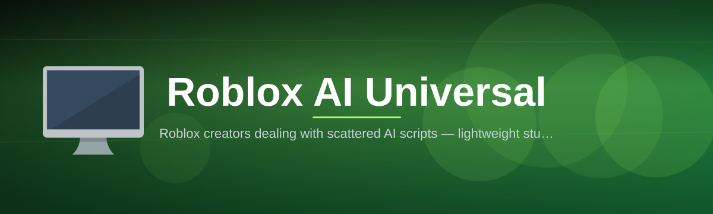

 

  
  
  

  

  
  

---

**Roblox AI Universal Script Studio — one desktop control deck, 34 AI-driven modules, zero Luau homework.**

I built this because I got tired of watching people paste the same broken 400-line script into a Roblox chat box every time a game patched. **Roblox AI Universal Script** is what happens when a script hub stops being a folder of pastebins and starts behaving like an actual desktop application: a single `.exe`, a real module library, saved profiles, a sandbox console, and an updater that tells you when a module goes stale instead of silently failing mid-session.

Everything below is the same page our users read before they download. No build tools, no package managers, no cloning. You grab the archive from the landing page, extract it, run the executable, and you are inside the hub in under a minute.

---

### 🎮 Download Roblox AI Universal Script Studio

Grab the current 2026 build from the project landing page. The archive is self-contained — the runtime, module pack, and default profile set ship inside it.

  

> First launch on a fresh Windows install may show a SmartScreen prompt because the build is not code-signed with an EV certificate yet. "More info" → "Run anyway" is the expected path.

---

## 🚧 The Problem

Script hubs for Roblox have been stuck in 2019, and the pain is very specific:

- **Pastebin roulette.** You find a "universal" script, paste it, and half the functions reference an external `loadstring` that no longer resolves. You spend twenty minutes debugging someone else's abandoned code instead of playing.
- **Zero module visibility.** Nobody tells you what the script actually does. Is it touching your camera? Your input? Your inventory? You find out when something breaks.
- **Configs die with the session.** Every hotkey, FOV value, and filter toggle resets the moment you rejoin. There is no profile system, so you re-tune everything from scratch.
- **Patch-day amnesia.** A game updates, three offsets shift, and the entire script silently no-ops. You get no error, no log, no signal — just nothing.
- **Alt-tab whiplash.** Discord for the script, browser for the config paste, Notepad for your hotkey notes, and the game itself fighting for GPU time.
- **AI branding with no AI inside.** "AI-powered" usually means a random number generator with a nicer variable name. No prediction model, no behavior analysis, no adaptive tuning.
- **No rollback.** A bad module update tanks your session and there is no way to go back to the build that worked yesterday.

---

## 🗺️ Overview

| Category | Details |
|---|---|
| Product | Roblox AI Universal Script Studio |
| Current build | v2.7.4 (stable channel, 2026) |
| Distribution | Windows desktop `.exe`, portable archive |
| Module count | 34 active modules across 5 categories |
| Script engine | Roblox Luau, executed through the studio runtime |
| Interface | Native overlay hub UI + separate settings window |
| Profiles | 12 shipped presets, unlimited user profiles |
| Storage | Local profile vault, ~48 MB unpacked |
| Update path | In-app channel router (stable / beta / pin-to-build) |
| First-run time | Under 60 seconds from extraction |
| Documentation | This README + in-app module tooltips |

The studio is deliberately split into two halves. The **runtime** is a lightweight `.exe` that attaches to your Roblox session and exposes a module bus. The **studio shell** is the part you actually see — a hub UI with toggle cards, a profile switcher, a sandbox console for testing snippets, and a status board that reports which modules are healthy, degraded, or waiting on a game patch. Modularity is the whole point: if you only want aim prediction and an ESP overlay, you disable the other 32 modules and the runtime drops to roughly 60 MB of resident memory.

---

## 📖 What is Roblox AI Universal Script?

| Term | Explanation |
|---|---|
| **Universal Script** | The shared entry layer that adapts a module to whichever Roblox experience is currently running, instead of hardcoding one game's structure. |
| **Module** | A self-contained feature unit (aim assist, movement control, ESP, UI, safety) that can be toggled, versioned, and rolled back independently. |
| **Profile** | A saved bundle of module states, hotkeys, tuning values, and filters that loads in one click. |
| **Hub UI** | The in-session overlay where you toggle modules, watch live values, and switch profiles without alt-tabbing. |
| **Sandbox Console** | An isolated Luau console for testing snippets before you commit them to a module or a profile. |
| **Channel Router** | The updater that decides whether you pull stable builds, beta builds, or pin yourself to a known-good version. |
| **Behavior Model** | The adaptive layer that watches your session's input rhythm and timing, and tunes the AI modules to match it. |

Why people stay on it:

- **Everything is one download.** Runtime, modules, profiles, and docs ship together — nothing fetches code from a random paste site at runtime.
- **You can see what is running.** Every module has a state, a version, and a live health indicator, so a failure is visible instead of silent.
- **Profiles survive rejoins.** Your tuning is stored locally and reloaded automatically when a session reconnects.
- **Bad updates are reversible.** Snapshot vault keeps your last three working configurations ready to restore.
- **The AI layer actually adapts.** Prediction, timing, and prioritization models retune per session rather than shipping one static set of numbers.

---

## 🎚️ Compatibility & Platform Support

| Environment | Support | Notes |
|---|---|---|
| Windows 11 (64-bit) | ✅ Full | Primary target; overlay and hotkeys verified |
| Windows 10 22H2 (64-bit) | ✅ Full | Same feature parity as Windows 11 |
| Windows 8.1 | ⚠️ Limited | Runtime works; overlay transparency may not composite correctly |
| Roblox Player (desktop) | ✅ Full | Required for all in-session modules |
| Roblox Studio | 🧪 Test mode | Useful for testing snippets in the sandbox console |
| macOS / Linux | ❌ Not supported | Community Wine/Proton reports exist but are untested |
| Virtual machines | ⚠️ Limited | GPU passthrough recommended; overlay FPS drops in software rendering |
| Multi-monitor setups | ✅ Full | Overlay anchors to the primary Roblox window |
| Integrated GPUs | ✅ Full | Reduce ESP render distance if you drop below 60 FPS |

---

## 📦 Installation

1. **Download the archive** from the project landing page using the download button on this page. You get a single compressed package — no installer wizard, no background service.
2. **Extract it** with Windows Explorer or 7-Zip into a normal folder such as `C:\RobloxAIStudio`. Do not run it from inside the archive viewer; the runtime needs write access for the profile vault.
3. **Launch the executable** that sits in the extracted folder root. On first run, allow it through the Windows firewall prompt so the update channel router can check for module revisions.
4. **Attach to your Roblox session.** Open Roblox, join any experience, then click **Attach** in the studio shell. The status board should flip every module to a live state within a few seconds.
5. **Pick a profile and go.** Load `Universal Balanced` if you want a sane default, or `Minimal` if you only want the ESP overlay and nothing else.

If you plan to use the studio with a game that is not in the shipped adapter list, run the **Universal Script** entry layer once in the sandbox console — it will attempt to build an adapter from the experience's live structure and save it as a local profile.

---

## 📐 System Requirements

| Component | Minimum | Recommended |
|---|---|---|
| Operating system | Windows 10 21H1 (64-bit) | Windows 11 23H2 (64-bit) |
| Processor | Dual-core 2.4 GHz | Quad-core 3.2 GHz or better |
| Memory | 4 GB RAM | 16 GB RAM |
| Free disk space | 250 MB | 1 GB (profiles, snapshots, logs) |
| GPU | DirectX 11 capable | Dedicated GPU, 4 GB VRAM |
| Runtime | .NET desktop runtime (bundled) | Bundled runtime, latest build |
| Roblox client | Current Roblox Player | Current Roblox Player, 64-bit |
| Permissions | Standard user, firewall exception | Administrator (for overlay injection fallback) |
| Display | 1280×720 | 1920×1080 or higher |

---

## 🧭 Table of Contents

- [The Problem](#-the-problem)
- [Overview](#️-overview)
- [What is Roblox AI Universal Script?](#-what-is-roblox-ai-universal-script)
- [Compatibility & Platform Support](#️-compatibility--platform-support)
- [Installation](#-installation)
- [System Requirements](#-system-requirements)
- [The Solution](#-the-solution)
- [Key Features](#-key-features)
- [Module Catalog I — Combat & Targeting](#-module-catalog-i--combat--targeting)
- [Module Catalog II — Movement & Physics](#-module-catalog-ii--movement--physics)
- [Module Catalog III — Visual & ESP](#-module-catalog-iii--visual--esp)
- [Module Catalog IV — Interface & Utility](#-module-catalog-iv--interface--utility)
- [Module Catalog V — Stability & Safety Layer](#-module-catalog-v--stability--safety-layer)
- [Module Status Board](#-module-status-board)
- [Hotkey Reference](#️-hotkey-reference)
- [Known Issues](#-known-issues)
- [Comparison](#️-comparison)
- [FAQ](#-faq)

---

## 🔧 The Solution

| Problem | Solution |
|---|---|
| Pastebin roulette and dead loadstrings | All 34 modules ship inside the archive; nothing resolves remote code at runtime. |
| No visibility into what a script does | Per-module state cards with version, description, and live health indicators. |
| Configs reset every session | Local profile vault with 12 shipped presets and unlimited user profiles. |
| Silent failures after a game patch | Session Health Monitor flags degraded modules in the status board instead of failing quietly. |
| Alt-tabbing between four windows | Single hub UI overlay with hotkey binder and in-session profile switching. |
| "AI" that is just a random number | Behavior Model retunes prediction, timing, and prioritization per session. |
| No way back after a bad update | Snapshot Vault + channel router with pin-to-build, restoring the last three working states. |

---

## 🏆 Key Features

| Feature | Description | Benefit |
|---|---|---|
| Portable runtime | Single `.exe`, no installer service, no registry sprawl | Delete the folder to uninstall completely |
| Module bus architecture | 34 modules register on a shared bus with independent lifecycles | Disable anything you do not use; lower RAM and GPU

  

